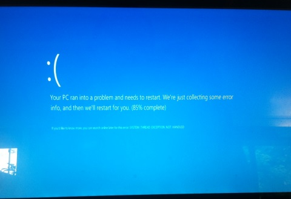

# AzureFileDrive (early alpha)

AzureFileDrive allows you to mount Azure File Storage (not blob storage) as a drive on a Windows machine __which is not in the Azure Data Centre__. 

AzureFileDrive is based on the Dokan user mode file system for Windows: http://dokan-dev.net/en/

## WARNING

This is an experiment. If you use this code, there is a good chance you will see this:

## Installation

* AzureFileDrive requires the Dokan library to be installed, this can be downloaded from here: http://dokan-dev.net/en/download/#dokan 

> For windows 8.x machine, run the installer in compatibility mode.

* Clone this repository and compile.
* Set your connection string (as described below).
* If you run Two10.AzureFileDrive.Console.exe, a new drive will appear in My Computer, which lists the containers in your storage account.

## Configuration

By default, AzureFileDrive mounts Azure File Storage on the R:\ drive, however you can change this in the .config file, by changing the `DriveLetter` setting.

Modify the `AzureConnectionString` setting to point to your Azure Storage account (i.e. `DefaultEndpointsProtocol=https;AccountName=YOUR_ACCOUNT_NAME;AccountKey=YOUR_ACCOUNT_KEY`)

## Limitations

* Performance is poor, and large files are not recommended.
* `dir *.xyz` doesn't work.
* Some files in the root folder don't open correctly on the command prompt.
* You cannot append to files.
* You cannot write to a part of a file.

## License

MIT
